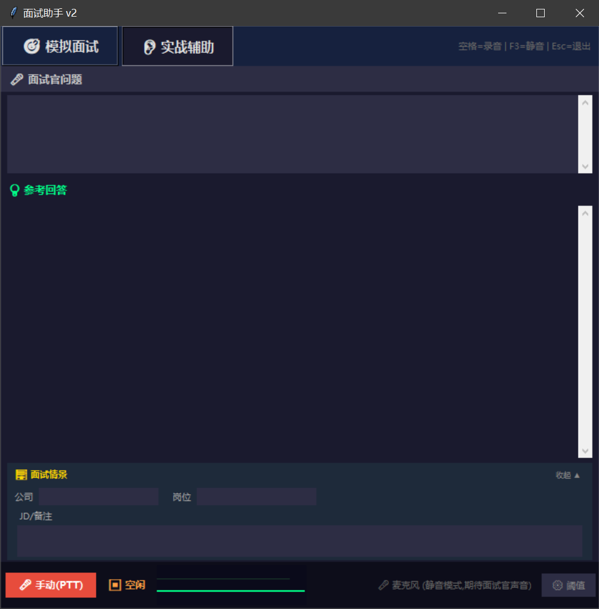

# 面试助手 v2

双模式面试辅助工具：模拟面试 + 实战辅助。语音识别转写 + AI 生成参考回答。

## 功能

- **🎯 模拟面试**：粘贴 JD → AI 面试官提问 → 语音回答 → AI 评分 + 总结报告
- **👂 实战辅助**：麦克风监听面试官提问 → 结合项目经历生成参考回答
- **🎤 手动/自动录音**：空格键控制录音，F3 一键静音
- **📊 实时音频波形**：可视化音频能量 + 可调阈值
- **🔧 多 LLM 后端**：DeepSeek / OpenAI 兼容 / Ollama 本地

## 环境要求

- Windows 10 / 11
- Python 3.10+
- 麦克风（内置或外接）

## 快速开始

### 1. 配置 API Key

```bash
copy config.example.toml config.toml
```

用记事本打开生成的 `config.toml`（不是 `config.example.toml`），在 `key` 处填入你的 API Key。

### 2. 启动

双击 `start.bat`，自动创建虚拟环境 + 安装依赖 + 打开界面。

### 3. 使用

- **模拟面试**：粘贴职位描述 → 点"开始面试"
- **实战辅助**：填写公司/岗位/JD → 按空格键开始录音

## 界面预览



## 录音模式说明

软件提供两种录音模式：

### 手动模式（PTT，推荐）
按**空格键**开始录音，再按一次停止。只有你按下按键时才会录音，完全由你控制，不会误录。

### 自动模式（VAD）
软件通过 WebRTC Voice Activity Detection 实时分析音频能量和语音特征，自动判断是否有人在说话：

1. 每一帧（30ms）计算 RMS 能量值，低于**静音阈值**的直接丢弃
2. 超过阈值的帧送入 VAD 模型，检测是否包含人声
3. 连续检测到人声 → 开始录音
4. 连续静音超过 1.5 秒 → 自动停止

**局限**：在面试场景中，面试官的声音（从电脑外放或环境传入麦克风）也可能触发录音，导致录到无关内容或打断当前处理。因此**建议优先使用手动模式**，确保每次录音都是你有意录制的。

## 配置文件

| 配置项 | 说明 | 默认值 |
|--------|------|--------|
| `api.key` | API 密钥 | — |
| `api.model` | 模型名 | `deepseek-chat` |
| `api.url` | API 地址 | `https://api.deepseek.com` |
| `audio.whisper_model` | 语音识别模型 (`tiny`/`base`/`small`) | `base` |
| `audio.energy_threshold` | 静音阈值 | `25` |
| `audio.user_speech_energy` | 用户语音阈值（助听模式） | `800` |
| `app.default_ptt` | 启动时默认手动模式 | `true` |
| `prompts.mock_role` | 模拟面试 AI 面试官身份 | `你是面试官，负责对候选人进行结构化面试` |
| `prompts.mock_rules` | 模拟面试出题规则 | 见 config.example.toml |
| `prompts.assist_role` | 实战辅助 AI 助手身份 | `你是面试辅助助手...` |
| `prompts.assist_rules` | 实战辅助回答规则 | `基于用户经历不编造、贴合公司岗位...` |

### 自定义身份设定

编辑 `config.toml` 的 `[prompts]` 段，可自由修改 AI 角色：

```toml
[prompts]
mock_role = "你是腾讯的面试官"
assist_role = "你是资深技术面试官，擅长深挖项目细节"
assist_rules = "追问技术方案细节、挑战候选人假设"
```

## 个人信息

项目经历存放在独立的 `profile.txt`，格式为 Markdown。AI 会基于这里的内容生成个性化回答。可参考 `profile.example.txt` 的格式来编写。

## 项目结构

```
面试助手/
├── start.bat                    # 一键启动
├── requirements.txt             # Python 依赖
├── config.toml                  # 配置文件（API Key、身份设定等）
├── config.example.toml          # 配置模板
├── interview-assistant.py       # 主程序
├── profile.txt                  # 个人项目经历
├── profile.example.txt          # 个人信息模板
└── .gitignore                   # Git 忽略规则
```

## 隐私说明

- API Key 和项目经历存储在独立文件中（`config.toml` / `profile.txt`），不会提交到代码仓库
- 语音录音在本地由 Whisper 转写，音频数据不上传
- AI 调用仅发送转写文本和项目经历到配置的 API 地址
